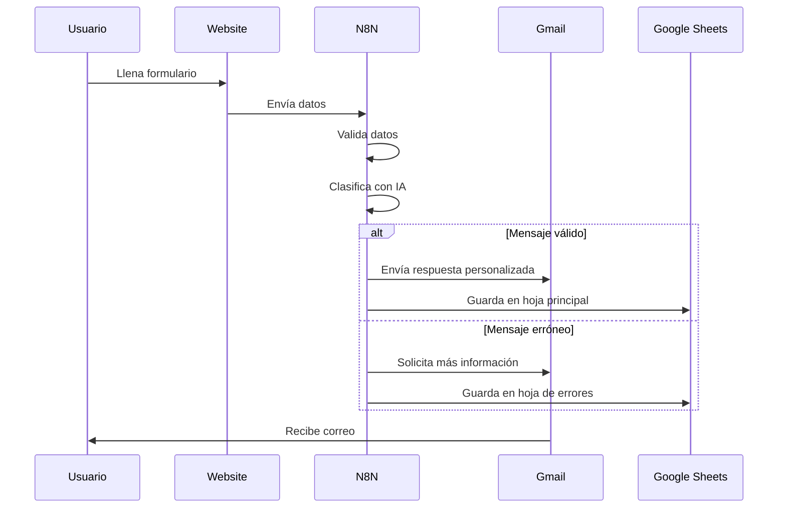
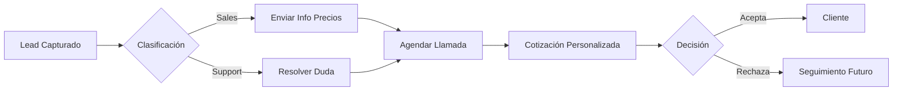
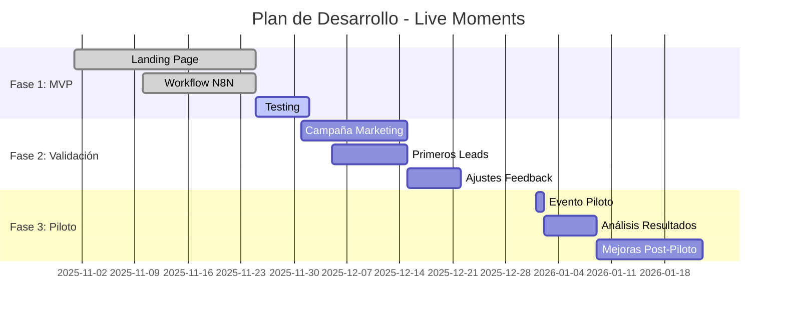

# 💡 Concepción del Proyecto - Live Moments

## 1. Problema Identificado

### Situación Actual
Las personas que organizan eventos importantes (bodas, cumpleaños, conferencias) enfrentan el desafío de que familiares y amigos lejanos no pueden asistir físicamente.

### Dolor del Cliente
- 😢 Seres queridos se pierden momentos importantes
- 📱 Soluciones caseras (videollamadas) tienen mala calidad
- 💰 Servicios profesionales son muy costosos o complicados
- 🎥 No hay opciones de streaming multicámara accesibles

---

## 2. Solución Propuesta

### Propuesta de Valor
**Live Moments** ofrece servicios de streaming profesional multicámara para eventos, permitiendo que cualquier persona en el mundo pueda vivir el momento como si estuviera presente.

### Diferenciadores
- 🎥 **Calidad Cinematográfica**: Múltiples cámaras profesionales
- 🌍 **Alcance Global**: Streaming a cualquier parte del mundo
- 🤖 **Automatización Inteligente**: IA para clasificar y responder solicitudes
- 💼 **Profesional pero Accesible**: Servicio premium a precio justo

---

## 3. Objetivos del Proyecto

### Objetivos SMART

#### Corto Plazo (1-3 meses)
- [ ] **S**pecific: Crear landing page funcional con formulario de contacto
- [ ] **M**easurable: Capturar al menos 10 leads por mes
- [ ] **A**chievable: Automatizar 100% de las respuestas iniciales
- [ ] **R**elevant: Validar interés del mercado
- [ ] **T**ime-bound: Completar en 1 mes

#### Mediano Plazo (3-6 meses)
- [ ] Realizar primer evento piloto
- [ ] Conseguir 3 clientes pagos
- [ ] Establecer proceso de producción estándar
- [ ] Crear portafolio con videos de eventos

#### Largo Plazo (6-12 meses)
- [ ] Escalar a 10+ eventos por mes
- [ ] Contratar equipo técnico
- [ ] Expandir a otras ciudades
- [ ] Desarrollar plataforma de streaming propia

---

## 4. Usuarios Objetivo

### Persona 1: "María - La Novia Organizada"
- **Edad**: 28-35 años
- **Situación**: Planea su boda, tiene familia en el extranjero
- **Necesidad**: Que sus abuelos en España vean la ceremonia en vivo
- **Presupuesto**: $500-$1500 USD
- **Tech-savvy**: Medio

### Persona 2: "Carlos - El Empresario"
- **Edad**: 40-50 años
- **Situación**: Organiza conferencia empresarial
- **Necesidad**: Streaming profesional para asistentes remotos
- **Presupuesto**: $2000-$5000 USD
- **Tech-savvy**: Alto

### Persona 3: "Ana - La Mamá Festejadora"
- **Edad**: 35-45 años
- **Situación**: Cumpleaños 15 de su hija
- **Necesidad**: Compartir el evento con familiares lejanos
- **Presupuesto**: $300-$800 USD
- **Tech-savvy**: Bajo

---

## 5. Casos de Uso Principales

### Caso de Uso 1: Solicitud de Presupuesto

### Caso de Uso 2: Seguimiento de Lead

---

## 6. Alcance del MVP (Producto Mínimo Viable)

### ✅ Incluido en MVP
- Landing page profesional
- Formulario de contacto funcional
- Automatización de respuestas con IA
- Clasificación de leads (ventas/soporte)
- Almacenamiento en Google Sheets
- Respuestas automáticas por email

### ❌ No Incluido en MVP (Futuras Versiones)
- Plataforma de streaming propia
- Sistema de pagos online
- Portal de cliente
- App móvil
- Calendario de reservas
- CRM integrado

---

## 7. Métricas de Éxito

### KPIs Principales
- **Tasa de Conversión**: % de visitantes que llenan el formulario
- **Tiempo de Respuesta**: Tiempo promedio de respuesta automática
- **Calidad de Leads**: % de leads que se convierten en clientes
- **Satisfacción**: NPS (Net Promoter Score)

### Metas Iniciales
- 📊 Tasa de conversión: >5%
- ⚡ Tiempo de respuesta: <1 minuto
- 💰 Conversión a cliente: >20%
- ⭐ NPS: >8/10

---

## 8. Riesgos y Mitigaciones

| Riesgo | Probabilidad | Impacto | Mitigación |
|--------|--------------|---------|------------|
| Baja demanda | Media | Alto | Validar con encuestas previas |
| Competencia | Alta | Medio | Diferenciarse con IA y automatización |
| Problemas técnicos | Media | Alto | Testing exhaustivo antes de lanzar |
| Costos elevados | Baja | Medio | Empezar con equipo básico |

---

## 9. Cronograma Inicial

---

## 10. Próximos Pasos Inmediatos

### Esta Semana
- [x] Crear landing page
- [x] Configurar workflow N8N
- [x] Corregir bugs de UI
- [ ] Testing completo del formulario
- [ ] Crear contenido para redes sociales

### Próxima Semana
- [ ] Lanzar en redes sociales
- [ ] Configurar Google Analytics
- [ ] Crear video demo del servicio
- [ ] Preparar paquetes de precios

### Próximo Mes
- [ ] Conseguir primeros 10 leads
- [ ] Realizar evento piloto
- [ ] Crear portafolio
- [ ] Establecer procesos operativos

---

**Fecha de Creación**: 2025-11-25  
**Última Actualización**: 2025-11-25  
**Estado**: ✅ Documentado
