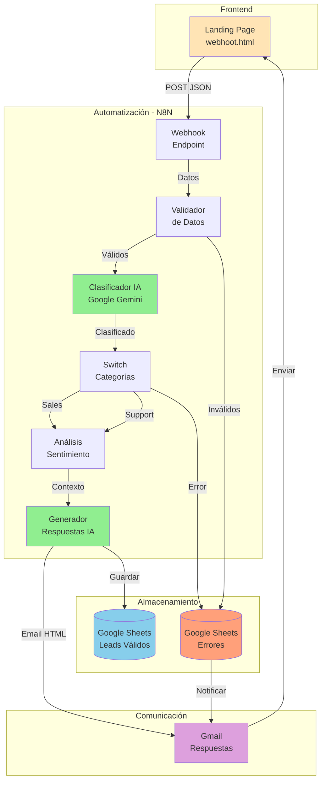
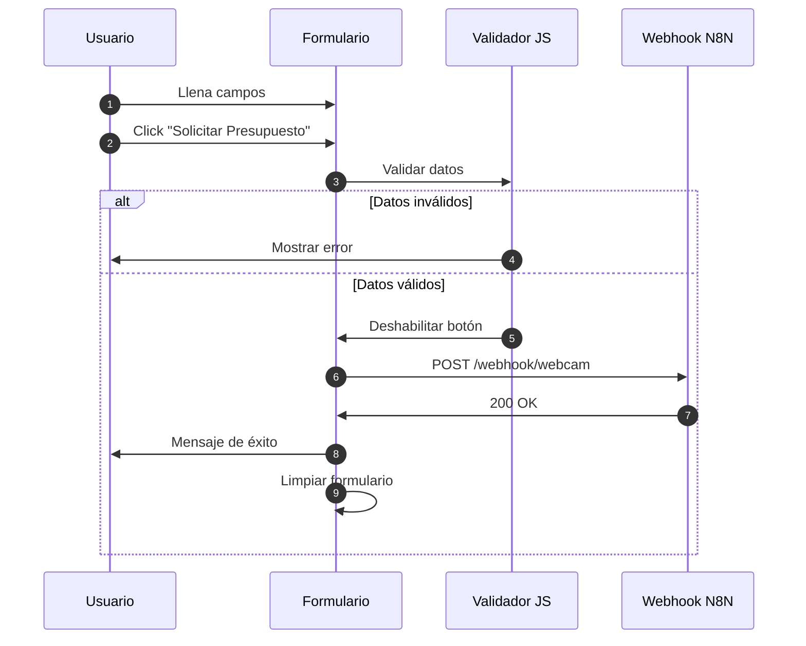
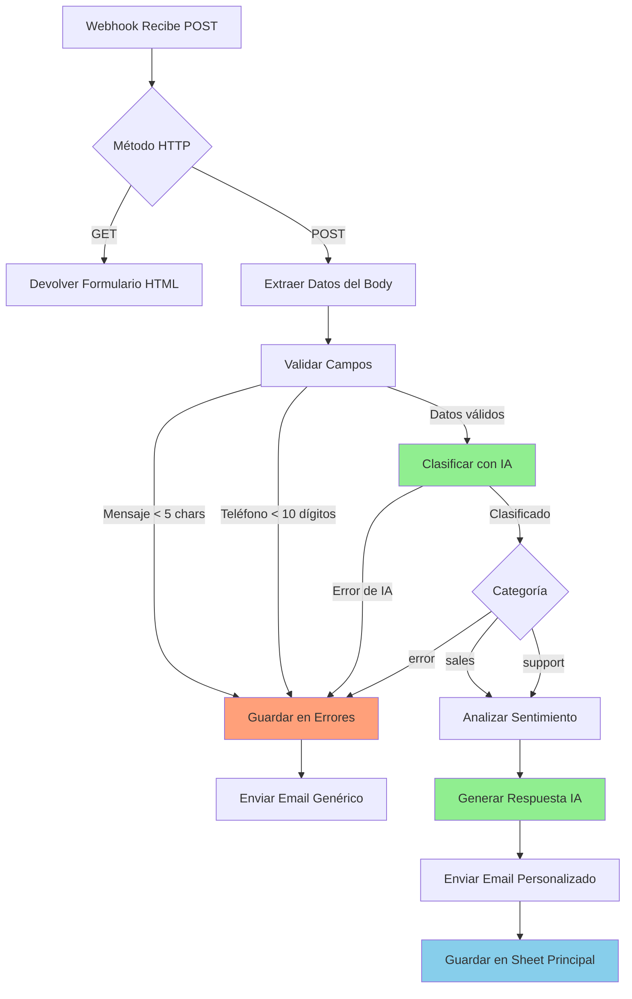
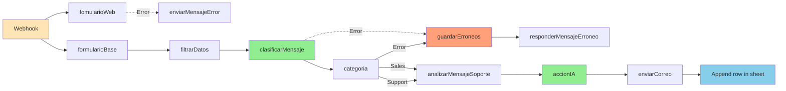
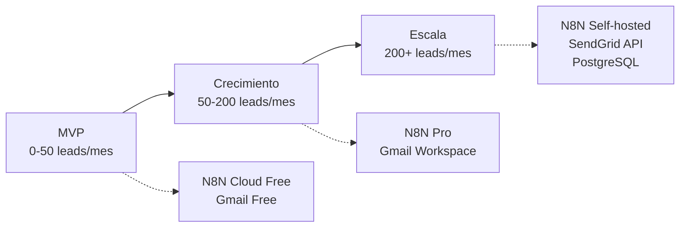

# 🏗️ Arquitectura Técnica - Live Moments

## 1. Diagrama de Arquitectura General



---

## 2. Stack Tecnológico

### Frontend
| Tecnología | Versión | Propósito |
|------------|---------|-----------|
| HTML5 | - | Estructura de la página |
| Tailwind CSS | CDN Latest | Estilos y diseño responsive |
| JavaScript Vanilla | ES6+ | Lógica del formulario |
| Google Fonts | - | Tipografía (Inter, Playfair Display) |

### Backend/Automatización
| Tecnología | Versión | Propósito |
|------------|---------|-----------|
| N8N | Cloud | Orquestación de workflows |
| Google Gemini | 2.5 Flash Lite | Clasificación de mensajes |
| Google Gemini | Flash Latest | Generación de respuestas |

### Integraciones
| Servicio | API | Propósito |
|----------|-----|-----------|
| Google Sheets | OAuth2 | Almacenamiento de datos |
| Gmail | OAuth2 | Envío de correos |
| Google Gemini | API Key | Procesamiento con IA |

---

## 3. Flujo de Datos Detallado

### 3.1 Captura de Lead



### 3.2 Procesamiento en N8N



---

## 4. Estructura de Datos

### 4.1 Formulario de Entrada

```json
{
  "usuario": "string",
  "correo_electronico": "string (email)",
  "numero_telefono": "string (numeric)",
  "mensaje": "string"
}
```

### 4.2 Datos Procesados (Google Sheets)

#### Hoja: Peticiones al Servidor
| Campo | Tipo | Descripción |
|-------|------|-------------|
| Usuario | String | Nombre completo |
| Correo Electronico | String | Email del cliente |
| Numero de telefono | String | Teléfono/WhatsApp |
| Fecha | DateTime | Timestamp de la solicitud |
| Mensaje original | String | Texto enviado por el usuario |
| Categoria | String | sales/support/error |
| Mensaje corregido | String | Versión mejorada por IA |

#### Hoja: Mensajes Erróneos
| Campo | Tipo | Descripción |
|-------|------|-------------|
| Usuario | String | Nombre completo |
| Correo Electronico | String | Email del cliente |
| Numero de telefono | String | Teléfono/WhatsApp |
| Mensaje | String | Texto enviado |
| Fecha | DateTime | Timestamp |
| Categoria | String | Siempre "error" |

---

## 5. Nodos del Workflow N8N

### Mapa de Nodos



### Descripción de Nodos

| Nodo | Tipo | Función | Error Handling |
|------|------|---------|----------------|
| Webhook | Trigger | Recibe requests HTTP | ❌ |
| fomularioWeb | Respond | Devuelve HTML del formulario | ✅ |
| formularioBase | Set | Extrae y estructura datos | ❌ |
| filtrarDatos | Filter | Valida longitud de campos | ✅ |
| clasificarMensaje | AI Agent | Clasifica y corrige mensaje | ✅ |
| categoria | Switch | Rutea según clasificación | ✅ |
| guardarErroneos | Google Sheets | Almacena mensajes inválidos | ❌ |
| responderMensajeErroneo | Gmail | Email a usuarios con errores | ✅ |
| analizarMensajeSoporte | Sentiment | Analiza tono del mensaje | ✅ |
| accionIA | AI Agent | Genera respuesta personalizada | ❌ |
| enviarCorreo | Gmail | Envía respuesta al usuario | ✅ |
| Append row in sheet | Google Sheets | Guarda lead procesado | ✅ |

---

## 6. Prompts de IA

### 6.1 Clasificador de Mensajes

**Modelo**: Google Gemini 2.5 Flash Lite

**Prompt Sistema**:
```
Eres un asistente experto en procesamiento de lenguaje natural para una 
empresa que vende recursos audiovisuales, servicios de streaming y 
conexiones de red para eventos.

Tareas:
1. Corregir errores gramaticales y de tipografía
2. Clasificar el mensaje:
   - "sales": Consulta de precios/servicios
   - "support": Problema técnico/ayuda
   - "error": Fuera de contexto o ininteligible

Devuelve SOLO este JSON:
{
  "clasificacion": "sales|support|error",
  "mensajeCorregido": "versión corregida"
}
```

### 6.2 Generador de Respuestas

**Modelo**: Google Gemini Flash Latest

**Prompt Sistema**:
```
Eres un especialista en comunicaciones para una empresa de streaming 
para eventos audiovisuales.

Genera SOLO el cuerpo del correo en HTML profesional.

Variables:
- Clasificación: [sales/support]
- Sentimiento: [normal/negativa]
- Mensaje: [texto del cliente]

Lógica:
- Sales: Agradecer, solicitar detalles (tipo evento, fecha, servicios)
- Support Normal: Confirmar recepción, solicitar ID/detalles técnicos
- Support Negativa: Disculpa profunda, escalación urgente, solicitar detalles

Devuelve JSON:
{
  "subject": "asunto del correo",
  "message": "cuerpo HTML"
}
```

---

## 7. Seguridad y Validaciones

### Frontend (JavaScript)
```javascript
// Validación de email
const isValidEmail = (email) => /^[^\s@]+@[^\s@]+\.[^\s@]+$/.test(email);

// Validación de teléfono
const isNumeric = (phone) => /^\\+?[\\d\\s\\-\\(\\)]+$/.test(phone);

// Validación de campos requeridos
if (!data.usuario || !data.correo_electronico || 
    !data.numero_telefono || !data.mensaje) {
    showFeedback('Por favor completa todos los campos.', 'error');
}
```

### Backend (N8N)
- **Longitud de mensaje**: > 4 caracteres
- **Teléfono**: > 9999999999 (10 dígitos)
- **Rate limiting**: Pendiente implementar
- **Sanitización**: Automática por N8N

---

## 8. Escalabilidad

### Limitaciones Actuales
- **N8N Cloud**: 5,000 ejecuciones/mes (plan gratuito)
- **Google Sheets**: 10M celdas por hoja
- **Gmail**: 500 emails/día (cuenta gratuita)
- **Gemini API**: Límites según plan

### Plan de Escalamiento



---

## 9. Monitoreo y Logs

### Métricas a Monitorear
- ✅ Ejecuciones exitosas del workflow
- ✅ Errores en nodos críticos
- ✅ Tiempo de respuesta promedio
- ❌ Tasa de conversión (pendiente Google Analytics)
- ❌ Uptime del webhook (pendiente)

### Notificaciones de Errores
- Email al administrador cuando falla un nodo crítico
- Registro en Google Sheets de mensajes erróneos

---

## 10. Decisiones Técnicas Clave

| Decisión | Alternativas Consideradas | Razón de Elección |
|----------|---------------------------|-------------------|
| N8N | Zapier, Make.com | Más flexible, self-hosteable |
| Google Gemini | OpenAI GPT, Claude | Gratuito, buena calidad |
| Google Sheets | PostgreSQL, MongoDB | Simple, sin servidor |
| Tailwind CSS | Bootstrap, CSS puro | Moderno, customizable |
| Vanilla JS | React, Vue | Simplicidad, sin build |

---

**Fecha de Creación**: 2025-11-25  
**Última Actualización**: 2025-11-25  
**Versión de Arquitectura**: 1.0
